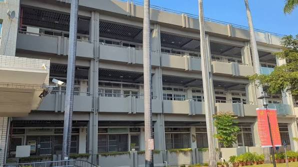

<div align="center">



# NUTN CSIE 116 畢業專題成果展

國立臺南大學資訊工程學系 116 級畢業專題展單頁網站

[首頁](#功能) · [快速開始](#快速開始) · [資料更新](#資料更新) · [專案結構](#專案結構)

</div>

## 專案簡介

這是一個以單頁分頁體驗呈現的畢業專題展網站，內容先依目前 116 級分組名單與去年展覽資訊建立，專題題目暫以 dummy text 佔位，後續可直接替換成正式資料。

視覺方向以深色藍調、編輯式資訊排版與 Liquid Glass 卡片為核心，讓參觀者可以快速掌握展覽介紹、單日議程、場地與交通資訊，並查看每組專題的詳細資料。

> [!NOTE]
> 目前網站仍是預覽版本。專題題目、投稿研討會標籤、正式議程與部分場地資訊確認後，再更新對應資料即可。

## 功能

- **首頁**：展覽介紹、日期與地點資訊、校址示意圖、展場平面圖，以及公車與汽／機車停車說明。
- **時程表**：以單日議程呈現兩個組別，可切換「智慧感知與訊號分析組」及「智慧推論與決策系統組」，時間戳採議程開始時間點排列。
- **專題一覽**：三欄專題卡片、組別篩選、成員與指導老師資訊，以及投稿成功後可顯示的 TANET、ICS、CVGIP 等研討會標籤。
- **專題詳細資訊**：在時程表或專題卡片上操作後，以 dialog 顯示專題題目、組別、成員、指導老師與投稿標籤。
- **Liquid Glass**：首頁資訊卡與時程卡片使用本地 vendored 的 WebGL Liquid Glass renderer；若瀏覽器能力不足，會保留 CSS glass fallback。
- **互動與無障礙**：支援網址 hash 分頁、鍵盤操作、跳到主要內容、ARIA tab/dialog 語意、焦點樣式與響應式版面。

## 快速開始

本專案是無框架的靜態網站，不需要安裝 npm dependencies。請使用 HTTP server 預覽：

```powershell
npx --yes http-server -p 4173
```

或使用 Python：

```powershell
py -m http.server 4173
```

接著開啟 <http://localhost:4173/>。

> [!IMPORTANT]
> 請不要直接雙擊 `index.html` 以 `file://` 開啟。Liquid Glass 需要 HTTP origin 來載入背景圖片、字體與 WebGL shader；直接使用檔案網址時，可能只會看到 CSS fallback 或出現跨來源限制。

## 開發與重新產生 bundle

主要互動程式碼位於 `script.js`，由 `app-entry.js` 載入本地 LiquidGlass library 後產生瀏覽器使用的 `app.js`。修改 `script.js`、`app-entry.js` 或 `vendor/liquidglass/index.js` 後，請重新產生 bundle：

```powershell
npx --yes esbuild app-entry.js --bundle --format=iife --global-name=NutnSiteApp --outfile=app.js
```

若只修改 `index.html`、`styles.css` 或 `tokens.css`，不需要重新 bundle。瀏覽器若持續使用舊版 CSS/JS，可重新整理頁面或清除快取。

## 資料更新

專題資料集中在 `script.js` 的 `projects` 陣列，每筆資料包含：

- `id`：組別編號。
- `group`：`sense` 或 `decision`，對應兩個議程分組。
- `title`：專題題目，目前是 dummy text。
- `members`：組員姓名。
- `studentIds`：學生學號資料，供後續內容維護使用。
- `advisor`：指導老師。
- `time`：議程時間區間；畫面會取開始時間作為時間戳。
- `conferenceTags`：投稿成功的研討會標籤，例如 `TANET`、`ICS`、`CVGIP`。

更新正式資料時，建議同步確認：

1. `projects` 的組別與人員資料。
2. `conferenceTags` 是否確實代表已投稿成功的研討會。
3. `index.html` 中的展覽日期、地點、場地圖與交通說明。
4. `tokens.css` 與 `styles.css` 的版本 query string 是否需要遞增。

## 專案結構

```text
.
├── index.html                    # 單頁網站骨架與靜態內容
├── script.js                     # 分頁、議程、專題資料與互動邏輯
├── app-entry.js                  # LiquidGlass 與主程式的 bundle entry
├── app.js                        # 瀏覽器實際載入的 bundled script
├── styles.css                    # 版面、元件、responsive 與 glass fallback 樣式
├── tokens.css                    # 顏色、字體、間距、圓角與動態 token
├── images.jpg                    # 全頁校園背景圖
└── vendor/liquidglass/index.js   # 本地 LiquidGlass WebGL renderer
```

## 瀏覽器支援

網站以現代瀏覽器為目標，Liquid Glass 需要 WebGL 1.0、Canvas 2D 與 SVG `foreignObject`。Chrome、Edge、Firefox 與 Safari 的近期版本通常都能正常運作；若 WebGL 或跨來源資源不可用，頁面仍會以 CSS 卡片樣式顯示主要內容。

Liquid Glass 會取樣 `images.jpg` 作為背景場景，因此部署時請確保網站透過 HTTP/HTTPS 提供，並讓背景圖片與網站使用相同來源或正確設定 CORS。

## 相關連結

- [國立臺南大學](https://www.nutn.edu.tw/)
- [國立臺南大學資訊工程學系](https://csie.nutn.edu.tw/)
- [LiquidGlass library](https://github.com/ybouane/liquidglass)
