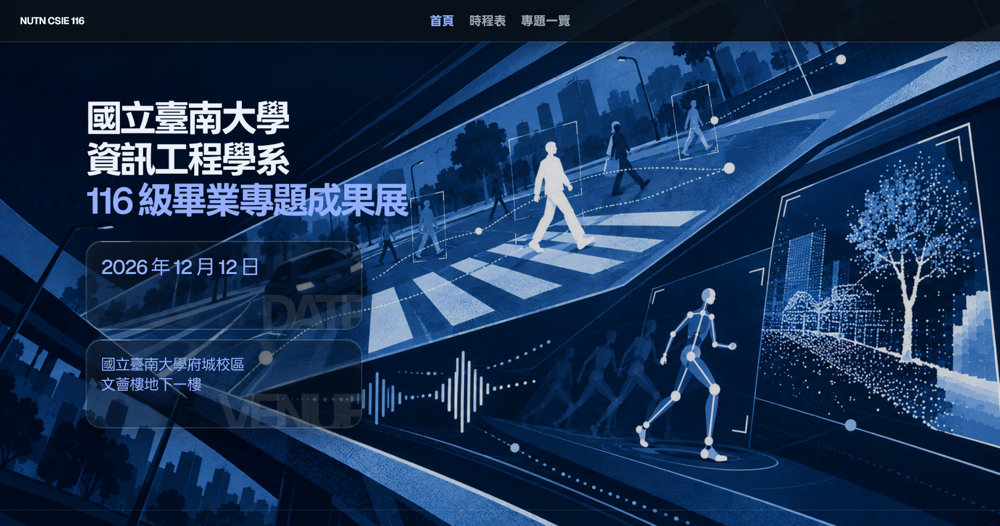

<div align="center">



# NUTN CSIE 116 畢業專題成果展

國立臺南大學 資訊工程學系 116 級 畢業專題展網站

</div>

## 📢 Introduction

這是一個以單頁分頁體驗呈現的 2026 畢業專題展網站，內容依目前 116 級分組名單與展覽資訊建立，專題題目欄位可直接替換成系上公告的正式題目。

視覺方向以深色藍調、編輯式資訊排版與 Liquid Glass 卡片為核心，讓參觀者可以快速掌握展覽介紹、單日議程、場地與交通資訊，並查看每組專題的詳細資料。

> [!NOTE]
> 專題題目與投稿研討會標籤可依系上最終公告，直接更新對應資料欄位。

## 🐛 回報網站問題

若發現頁面顯示或操作異常，請至 GitHub 的 **Issues → New issue → 網站問題回報**，提供發生問題的頁面、裝置／瀏覽器、重現步驟，以及預期與實際結果。Issue 範本會引導填寫；[填寫範例與注意事項](docs/issue-report-example.md)可供參考。請勿貼上學號、個人資料、未公開專題內容或未遮蔽的敏感資訊。

## ✨ Features

- **首頁**：展覽介紹、日期與地點資訊、校址示意圖、展場平面圖，以及公車與汽／機車停車說明。
- **時程表**：以單日議程呈現兩個組別，可切換「智慧感知與訊號分析組」及「智慧推論與決策系統組」，時間戳採議程開始時間點排列。
- **專題一覽**：三欄專題卡片、組別篩選、成員資訊，以及投稿成功後可顯示的 TANET、ICS、CVGIP 等研討會標籤。
- **專題詳細資訊**：在時程表或專題卡片上操作後，以 dialog 顯示專題題目、組別、成員與投稿標籤。
- **Liquid Glass**：首頁資訊卡使用本地 LiquidGlass WebGL renderer，主視覺背景則由單一固定 WebGL canvas 繪製，並共用同一張背景場景供卡片取樣。只初始化目前分頁、接近可視範圍的卡片；手機依裝置能力降低內部 render resolution。捲動中保留完整 glass surface，隨畫面更新可見卡片並輪流處理兩張卡，不切換成另一套 placeholder；停止捲動後補上最後的位置更新。DOM capture 與預熱則延後到實際需要時執行。
- **桌面捲動手感**：精細指標的桌面裝置使用本地 Lenis wheel easing；手機觸控捲動維持原生行為，並尊重系統減少動態效果設定。捲動動畫只在輸入期間啟動 RAF，避免閒置時持續佔用影格。
- **互動與無障礙**：支援網址 hash 分頁、鍵盤操作、跳到主要內容、ARIA tab/dialog 語意、焦點樣式與響應式版面。

## 🚀 Quick Start

本專案是無框架的靜態網站，不需要安裝 npm 依賴。正式部署時只需要交付網站執行檔案；本地預覽建議使用 HTTP server，以下擇一即可：

```shell
npx --yes http-server -p 4173
# python
py -m http.server 4173
```

接著開啟 <http://localhost:4173/>。

> [!IMPORTANT]
> 請不要直接雙擊 `index.html` 以 `file://` 開啟。Liquid Glass 需要 HTTP origin 來載入背景圖片、字體與 WebGL shader；直接使用檔案網址時，可能只會看到 CSS fallback 或出現跨來源限制。

## ⚙️ Develop & Regenerate bundle

主要互動程式碼位於 `script.js`，由 `app-entry.js` 載入本地 LiquidGlass 與 Lenis library 後產生瀏覽器使用的 `app.js`。目前 LiquidGlass 僅用於首頁日期／地點大型卡片；首頁背景使用單一 WebGL canvas，時程表議程採用不依賴 WebGL 的 CSS／SVG Signal Glass，以保持捲動穩定。修改 `script.js`、`app-entry.js` 或 `vendor/` 內的來源後，請重新產生 bundle，並同步到 `release/`：

```powershell
npx --yes esbuild app-entry.js --bundle --format=iife --global-name=NutnSiteApp --outfile=app.js
Copy-Item .\app.js .\release\app.js -Force
```

若只修改 `index.html`、`styles.css` 或 `tokens.css`，不需要重新 bundle；若修改 CSS，也請同步複製至 `release/`。瀏覽器若持續使用舊版 CSS/JS，可重新整理頁面或清除快取。

捲動回歸檢查可在本地 HTTP server 啟動後，以 Playwright CLI 開啟首頁，再執行 `run-code --filename tests/glass-scroll-probe.js`。

## 🛠️ Data Update

專題資料集中在 `script.js` 的 `projects` 陣列，每筆資料包含：

- `id`：組別編號。
- `group`：`sense` 或 `decision`，對應兩個議程分組。
- `title`：專題題目，現階段以組別作品名稱呈現，可替換為正式題目。
- `members`：組員姓名。
- `studentIds`：學生學號資料，供後續內容維護使用。
- `advisor`：舊資料欄位，目前不會顯示在公開頁面。
- `time`：議程時間區間；畫面會取開始時間作為時間戳。
- `conferenceTags`：投稿成功的研討會標籤，例如 `TANET`、`ICS`、`CVGIP`。

更新正式資料時，建議同步確認：

1. `projects` 的組別與成員資料；`advisor` 為舊欄位，不會顯示在公開頁面。
2. `conferenceTags` 是否確實代表已投稿成功的研討會。
3. `index.html` 中的展覽日期、地點、場地圖與交通說明。
4. `index.html` 的 JS／CSS 版本 query string 是否需要遞增，避免瀏覽器沿用快取。

## 📁 Project Layout

網站英數字使用 Geist，繁體中文使用 LINE Seed TW。LINE Seed TW 依 SIL Open Font License 1.1 授權；授權全文隨字型放在 `assets/fonts/LINE-SEED-OFL.txt`。Lenis 1.3.26 以 MIT 授權本地打包，授權全文放在 `vendor/lenis/LICENSE`。

```text
.
├── index.html                    # 單頁網站骨架與靜態內容
├── script.js                     # 分頁、議程、專題資料與互動邏輯
├── app-entry.js                  # LiquidGlass 與主程式的 bundle entry
├── app.js                        # 瀏覽器實際載入的 bundled script
├── hero-ripple.js                # 首頁主標題的滑鼠波紋效果
├── styles.css                    # 版面、元件、responsive 與 glass fallback 樣式
├── tokens.css                    # 顏色、字體、間距、圓角與動態 token
├── images.jpg                    # WebGL 背景 canvas 的校園影像來源
├── assets/fonts/                 # 本地 WOFF2 字體資源
├── assets/images/                # 校址示意圖與展場平面圖
├── vendor/liquidglass/index.js   # 本地 LiquidGlass WebGL renderer
├── vendor/lenis/                 # 本地 Lenis 原始碼、樣式與 MIT 授權
├── tests/                        # 主標題與玻璃捲動回歸檢查
├── release/                      # 可交付部署的靜態網站副本
└── 404.html                      # 網站自訂錯誤頁
```

`app.js` 已包含 LiquidGlass 與網站互動程式；`script.js`、`app-entry.js` 與 `vendor/` 是後續維護與重新 bundle 時才需要保留的原始檔案。

## 🌐 Supported Browsers

下表是完整視覺體驗的建議最低版本，不代表更舊瀏覽器一定無法閱讀。基準包含對 `text-wrap: balance` 等排版增強的支援；主要文字與導覽在玻璃效果不可用時仍會以一般 CSS 樣式呈現。

| Browser | 建議版本 | 網站內容／dialog | Lenis 桌面滾輪 | Liquid Glass |
| --- | --- | --- | --- | --- |
| Chrome | 114+ | ✅ | ✅ | ✅* |
| Edge | 114+ | ✅ | ✅ | ✅* |
| Safari | 17.5+ | ✅ | ✅ | ✅* |
| Firefox | 121+ | ✅ | ✅ | ✅* |
| Zen Browser | 最新穩定版（Firefox engine 121+） | ✅ | ✅ | ✅* |

Lenis 僅在精細指標（例如滑鼠／觸控板）且系統未要求減少動態效果時啟用；觸控捲動維持原生行為。

`*` Liquid Glass 需要可用的 WebGL 1.0、Canvas 2D 與 SVG `foreignObject`，也受 GPU、驅動程式與瀏覽器圖形設定影響；不可用時保留 CSS 卡片樣式。[WebGL 支援亦取決於裝置圖形硬體](https://developer.mozilla.org/en-US/docs/Web/API/WebGL_API)。

最低版本參考短標題排版功能的跨瀏覽器支援：Chrome／Edge 114、Safari 17.5、Firefox 121。[Chrome 114](https://developer.chrome.com/blog/new-in-chrome-114)、[Safari 17.5](https://webkit.org/blog/15383/webkit-features-in-safari-17-5/)、[Firefox 121](https://www.mozilla.org/en-US/firefox/121.0/releasenotes/)。Safari 與 Firefox 的 Liquid Glass 視覺可能和 Chromium 不同，部署前建議在目標裝置實測。

Liquid Glass 會取樣 `images.jpg` 作為背景場景，因此部署時請透過 HTTP/HTTPS 提供網站，並讓背景圖片與網站使用相同來源，或正確設定 CORS。

## 📝 Related Resources

- [國立臺南大學](https://www.nutn.edu.tw/)
- [國立臺南大學資訊工程學系](https://csie.nutn.edu.tw/)
- [LINE Seed TW Font](https://seed.line.me/index_tw.html)
- [Geist Font](https://fonts.google.com/specimen/Geist)
- [Glyphs 4](https://glyphsapp.com/)
- [LiquidGlass library](https://github.com/ybouane/liquidglass)
- [Lenis smooth scroll](https://github.com/darkroomengineering/lenis)
- [emilkowalski/skills](https://github.com/emilkowalski/skills)
- [Impeccable](https://github.com/pbakaus/impeccable)
- [jakubkrehel/better-interface](https://github.com/jakubkrehel/skills)
- [Anti-AI-slop design](https://github.com/Nutlope/hallmark)
